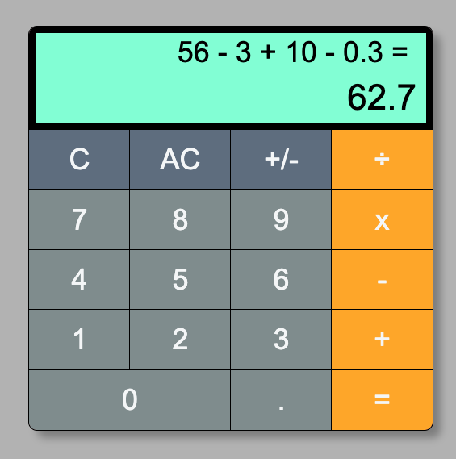

# React Calculator

## 啟動 React Calculator

下載此專案後，輸入下列指令安裝所需套件：

> `npm install`

啟動 React Calculator：

> `npm start`

即可透過網頁瀏覽器使用。

---

## 使用說明

### 可用滑鼠拖放

透過滑鼠即可將計算機移動至不同的位置，方便使用。

### 雙重顯示螢幕

- 上方螢幕：顯示輸入的算式，方便您確認算式是否正確
- 下方螢幕：顯示得出的數值

### 多種功能按鍵

- **C**：清除所得數值，並清除算式內最後輸入的數字或數學運算子。
- **AC**：清除算式及所得數值。
- **+/-**：為算式內最後輸入的數字加上負號。
- **+**、**-**、**x** 及 **÷**：數學運算子。計算時遵守**先乘除後加減**原則。
- **=**：得出算式數值。
- 數字 **0** - **9**：輸入數字。
- **.**：小數點。

### 提供滑鼠介面

滑鼠：可使用上述所有按鍵。點按時，按鍵顏色會改變，作為視覺提示。

### 提供鍵盤介面

功能對應按鍵如下：

- **Clear** 或 **Backspace**：清除所得數值，並清除算式內最後輸入的數字或數學運算子
- **+**、**-**、**\*** 及 **/**：數學運算子。計算時遵守**先乘除後加減**原則。
- **=** 或 **Enter**：得出算式數值。
- 數字 **0** - **9**：輸入數字。
- **.**：小數點。
  > 未提供對應於 **AC** (清除算式及所得數值) 和 **+/-** (為算式內最後輸入的數字加上負號) 的鍵盤功能。

### 適應不同大小裝置

可在一般桌面電腦及行動裝置上使用。

---

## 功能限制

算式可得出的最大數值為 2^32。超過此數值則顯示 **NUMBER TOO BIG**。

---

## 專案技術

採用 React 17 及 Emotion.js (建立 styled component)，以 function component、內建 Hook 及 custom Hook 進行實作。
